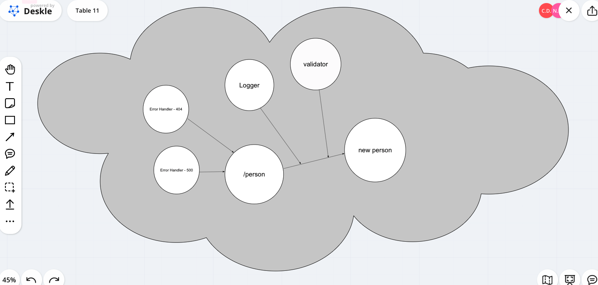

# LAB 02: basic-express-server

## Author: Jason Quaglia

- [Link to Heroku Deployment](https://basic-express-server-jquaglia.herokuapp.com/)

- [Link to Github Actions Tab](https://github.com/jquaglia/basic-express-server/actions)

- [Link to PR on Github](https://github.com/jquaglia/basic-express-server/pull/1)

## The Setup

### Getting Started

1. Clone down the repository

1. Run the command `npm install`

1. Create a `.env` file with `PORT` variable

### Testing the Server

1. Run the command `npm test` to test the server

### Running the Server

1. To run the server locally, run `nodemon`

1. Open up your browser to the localhost you set your `PORT` variable to

## UML

